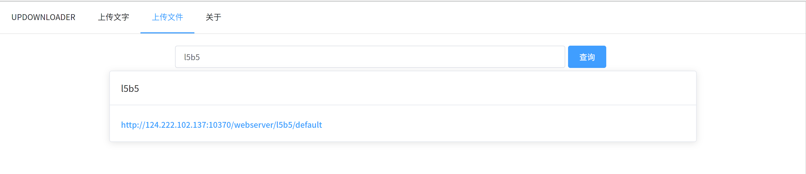
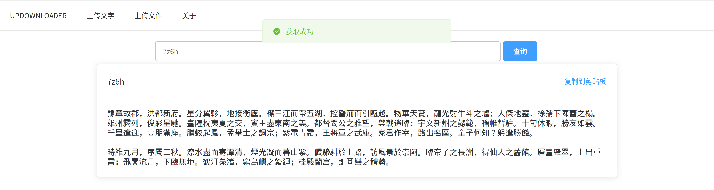
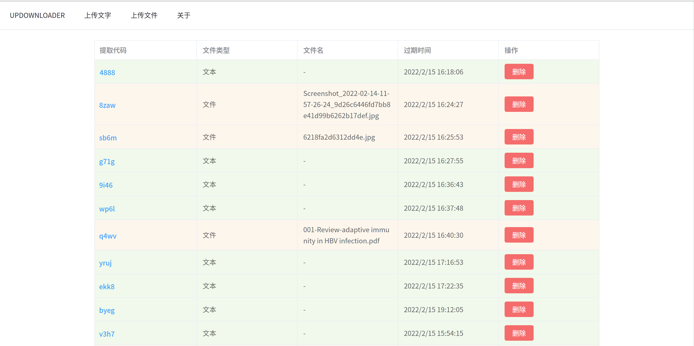

# UPDOWNLOADER

一个支持命令行、PC端、移动端上传、下载文字或者文件的前后端分离网站。使用 [GPLv3](https://www.gnu.org/licenses/gpl-3.0.html) 协议。

## 使用场景

- 电脑上有一个链接，不想使用QQ或者邮箱发到手机上面
- 不想或者不能使用scp命令在云服务器上拷一个文件
- 买了台云服务器，不知道干什么

——那就来使用 UPDOWNLOADER 吧！

## 部署

前后端分离部署。需要安装 MySQL。

### 后端

后端可以直接进入 backend 目录 `go build`，将生成的文件和配置文件上传至服务器。

如果你的电脑和服务器的 glibc 版本不一致，可以使用

```bash
CGO_ENABLED=0 go build -a -ldflags '-extldflags "-static"' .
```

来编译。下面的执行命令供你参考：

```bash
nohup ./updownloader-backend conf.toml > log.txt 2>&1 &
```

```toml
listeningAddress="0.0.0.0:10370" # 本机的监听地址
webserverAddress="127.0.0.1:10370" # 暴露出去的地址。填公网 IP
basepath="/data/updownloader" # 确保目录读写权限正确
dblink="root:123456@tcp(127.0.0.1:3306)/updownloader?charset=utf8mb4&parseTime=True&loc=Local" # MySQL 的帐号密码地址，要创建一个叫 updownloader的数据库
expireHourNum=3
```

### 前端

进入 frontend/updownloader-frontend 目录`npm run build`以后部署生成的 dist 文件夹。可以使用 nginx。下面是部署到 updown 子路径的例子。

```
location ^~/updown {
	alias YOUR_DIST_PATH;
	index index.html index.htm;
	try_files $uri $uri/ /updown/index.html;
}
```

### 命令行

```
upload: curl -X POST http://BACKEND_ADDRESS/updown/file -F "file=@YOUR_FILE_PATH"
query:  curl http://BACKEND_ADDRESS/updown/record/YOUR_CODE
```

如果你不幸忘记了 curl 的用法，可以 `curl http://BACKEND_ADDRESS/usage` 来取得上面的用法。

## 使用

取得内容时，可以在输入框里输入代码，也可以直接在网站链接后面加上代码。

取得文件：



取得文本：



后台（隐藏功能，在网站链接后面加上`/admin`以进入）：



考虑到使用的方便性，完全没有做鉴权处理。所以没有将后台暴露出来。
